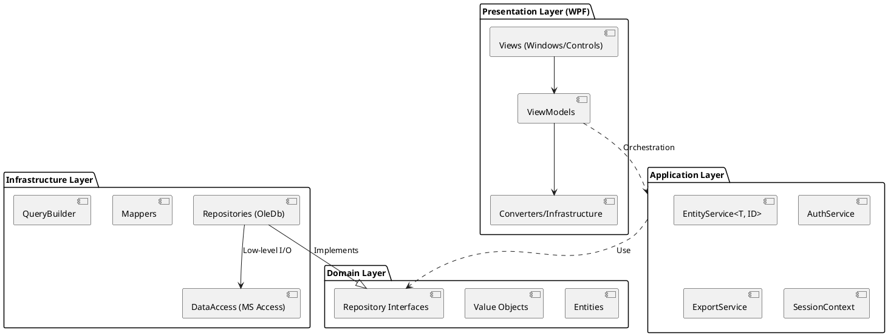
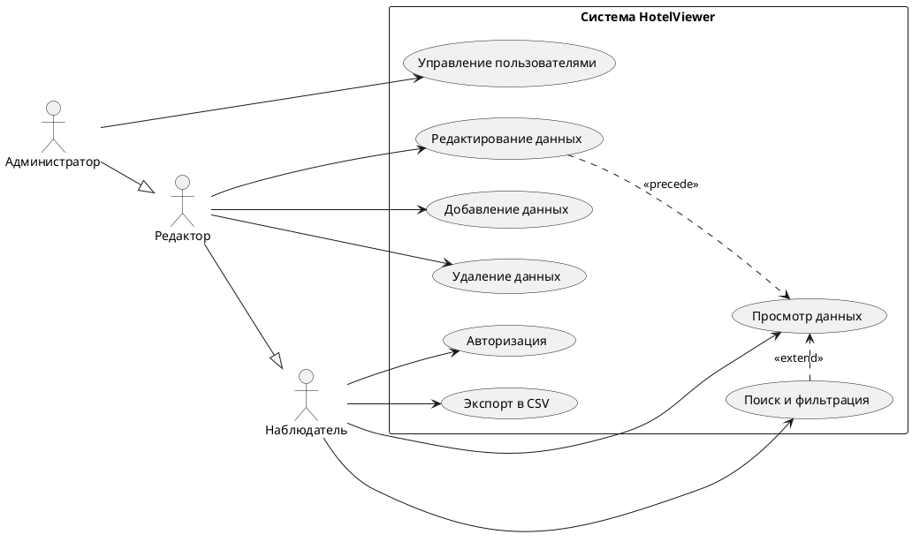
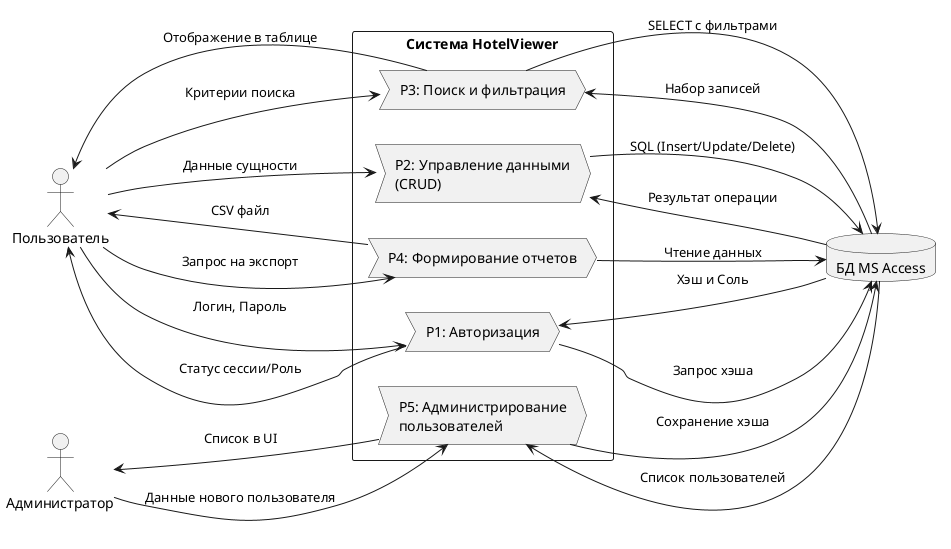

# HotelViewer

Десктопное приложение для **безопасного** управления отелями.

## Программный стек и инструменты

| Инструмент          |           Версия           | Предназначение                                                                  |
|:--------------------|:--------------------------:|:--------------------------------------------------------------------------------|
| C#                  |            14.0            | Язык программированя                                                            |
| .NET                |            10.0            | Платформа разработки и рантайма                                                 |
| LanguageExt         |       5.0.0-beta-77        | Библиотека с инструментами функционального программирования                     |
| xUnit.v3            |       4.0.0-pre.128        | Платформа модульного тестирования                                               |
| WPF                 |             -              | Платформа для декларативной разработки пользовательского интерфейса для Windows |
| Argon2Sharp         |           4.0.1            | Библиотека для хэширования паролей                                              |
| Micro$oft Access    |             -              | База данных                                                                     |
| System.Data.OleDb   | 11.0.0-preview.5.26302.115 | Библиотека для низкоуровнего общения с базой данных в среде ОС Windows          |
| Microsoft.ACE.OLEDB |             -              | Драйвер для OleDb для общения с базой данных Micro$oft Access                   |

### Архитектура

Для обеспечения минимальной связности компонентов, чтобы обеспечить лёгкую портативность кодовой базы меж
разными базами данных, фреймворков для написания пользовательского интерфейса и прочего, был использован
паттерн проектироввания DDD (Domain-Driven Design). Решение разделено на четыре проекта, которые отвечают
за разные задачи:
- `HotelViewer.Domain` - тут хранится основная логика и интерфейсы репозиториев
- `HotelViewer.Infrastructure` - общение с инфраструктурой (сторонние API, работа с файлами, БД и так далее).
  В нашем случае тут работа с базой данных MS Access через библиотеку `System.Data.OleDb` и драйвер
  `Microsoft.ACE.OLEDB.12.0`. Также тут реализуются интерфейсы репозиториев.
- `HotelViewer.ApplicationLayer` - прикладной уровень, отвечает за оркестрацию всем этим безумием.
- `HotelViewer.Presentation` - уровень презентации, отвечает за I/O с пользовательской стороны.

#### UML диаграммы
##### Архитектура

##### Use-case

##### Диаграмма с потоком данных (DFD)

Для большей надёжности, что было указано в ТЗ, были применены некоторые паттерны функционального программирования,
в частности - монады `Either` и `Option`, что позволяет нам избавиться от неожиданных исключений (точнее минимизировать их),
а также избавиться от типа `null`, заменив его на `Option`. Из этой же рубрики можно сказать и про лямбда-выражения.

Для безопасности и, опять же, надёжности, что всё ещё указано в ТЗ, вместо алгоритма общего хэширования семейства SHA
был использован алгоритм Argon2, который устойчив благодаря "соли" к переборам по радужным таблицам и сам алгоритм тоже
устойчив к перебору хэшей через графические процессоры и ASIC фермы.

**[Ознакомиться с текстом технического задания](./TECH_TASK.md)**

## Развёртка

### Требования
- Драйвер Microsoft Access Database Engine: [Скачать можно тут](https://www.microsoft.com/en-us/download/details.aspx?id=54920)
- ОС семейства Windows (10 и новее)

### Сборка из исходного кода
1. Склонируйте этот репозиторий с помощью (требуется git с расширением git-lfs)
  - `git clone git@github.com:Urtyom-Alyanov/HotelViewer.git` - SSH (рекомендуется, ибо безопасно), требует авторизации
    в GitHub через SSH ключ
  - `git clone https://github.com/Urtyom-Alyanov/HotelViewer.git` - HTTPS, ничего не требует, но медленнее.
2. Запустите сборку приложения (требуется .NET SDK) - `dotnet build -c Release` или/а потом `dotnet run -c Release --project .\source\HotelViewer.Presentation\`

### Скачать уже собранный проект
- [Последняя версия](https://github.com/Urtyom-Alyanov/HotelViewer/releases/tag/latest)
- [Последний коммит](https://github.com/Urtyom-Alyanov/HotelViewer/releases/tag/master)

## Использование

Для использования проект, требуется скачать .accdb файл, его можно [скачать отсюда](./assets/PureHotels.accdb), после
загрузки - выберите его. Изначально в ней нет данных - загрузите их с помощью соответствующей кнопки на окне входа.

## Отчёт

Отчёт по практике [выложен тут](./assets/Report.docx). Хранится он в Git LFS.
